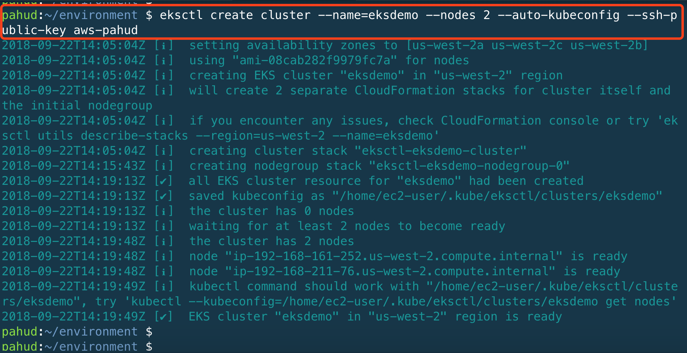

## Create your EKS Cluster with eksctl


`eksctl` is a CLI for Amazon EKS that helps you easily create Amazon EKS cluster!

eksctl website:  https://eksctl.io/


## Steps

1. Spin up your [Cloud9 IDE](https://us-west-2.console.aws.amazon.com/cloud9/home?region=us-west-2) from AWS console.


2. Create and name your environment


3. Leave everythong as default and click **Next Step**
4. Click **Create environment**

(It would typically take 30-60s to create your Cloud9 IDE)


5. We need to turn off the Cloud9 temporarily provided IAM credentials. 


6. When you turn off the temporary credentials, you should not be able to un AWS CLI now.


7. execute `aws configure` to configure the credentials for your IAM user. Make sure this IAM User has **AdministratorAccess** and run `aws sts get-caller-identity` - you should be able to see the returned JSON output like this.


8. Download the `kubectl` and `heptio-authenticator-aws` binaries and save to `~/bin`. Check the Amazon EKS User Guide for [Getting Started](https://docs.aws.amazon.com/eks/latest/userguide/getting-started.html). Download the Linux binary for `kubectl` and `heptio-authenticator-aws` one by one.

   ```
   $ mkdir ~/bin
   $ curl -o kubectl https://amazon-eks.s3-us-west-2.amazonaws.com/1.10.3/2018-07-26/bin/linux/amd64/kubectl && chmod +x kubectl && mv kubectl ~/bin/
   $ curl -o aws-iam-authenticator https://amazon-eks.s3-us-west-2.amazonaws.com/1.10.3/2018-07-26/bin/linux/amd64/aws-iam-authenticator && chmod +x aws-iam-authenticator && mv aws-iam-authenticator ~/bin/ && cd ~/bin && ln -s aws-iam-authenticator heptio-authenticator-aws
   ```

9. Download the `eksctl` from `eksctl.io`(actually it will download from GitHub)

   ```
   $ curl --silent --location "https://github.com/weaveworks/eksctl/releases/download/latest_release/eksctl_$(uname -s)_amd64.tar.gz" | tar xz -C /tmp
   sudo mv /tmp/eksctl /usr/local/bin
   ```


10. run `eksctl help`, you should be able to see the `help` messages


11. Create your Amazon EKS cluster witn `eksctl` and spin up a nodegroup with `2 nodes`

```
$ eksctl create cluster --name=<CLUSTER_NAME> --nodes 2 --auto-kubeconfig --ssh-public-key <EXISTING_SSH_KEY_NAME>
```




And create/update your `$HOME/.kube/config` with `aws eks update-kubeconfig`

```
aws eks update-kubeconfig --name eksdemo
```

(Ensure your aws-cli version is at least **1.16.18**, or follow [this gist](https://gist.github.com/pahud/b748f726515d3b073b997d92b595b526) to upgrade your aws-cli in Cloud9 )

After executing `aws eks update-kubeconfig`, a new context will be generated in `$HOME/.kube/config` and you can execute `kubectl get no` to list all nodes in the nodegroup.


Get the `cluster-info` or `get all` resources.


Now your Amazon EKS cluster is ready!  You may proceed to [customize your nodegroup](./customize-nodegroup.md) now.

If you need to delete this clusrer, run `eksctl delete cluster —name=<CLUSTER_NAME>` to trigger the deletion of the stack.

